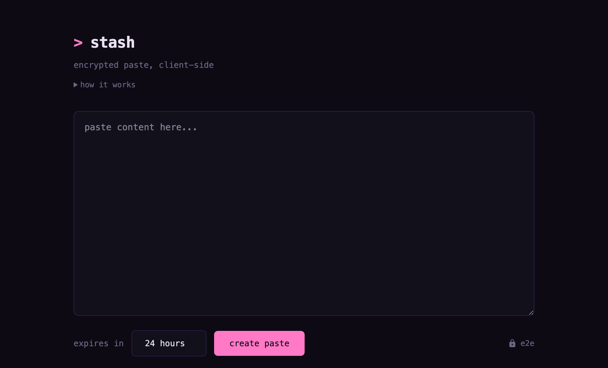

<p align="center"><strong>stash</strong> - encrypted pastebin in go</p>
<p align="center">
  
</p>
<p align="center">content encrypted client-side with AES-256-GCM. the key stays in the URL fragment and never leaves your browser.</p>

---

## run the server

```
go run ./cmd/stash-srv
```

flags: `-addr :8080` (listen address), `-db ./stash.db` (sqlite path)

## cli

```
# create paste from stdin
echo "secret" | go run ./cmd/stash

# fetch paste
go run ./cmd/stash get <url>

# delete paste
go run ./cmd/stash delete <delete-url>
```

flags: `-server http://localhost:8080`, `-ttl 3600` (seconds)

config file: `~/.stashrc`
```
server=https://stash.example.com
ttl=86400
```

## how it works

1. browser/cli generates AES-256 key
2. encrypts content locally
3. sends ciphertext to server
4. server returns paste ID
5. full URL is `https://server/p/{id}#v1:{key}`
6. key in fragment never sent to server

pastes auto-expire. delete links use a token hashed before storage so server can't delete without the original token.
